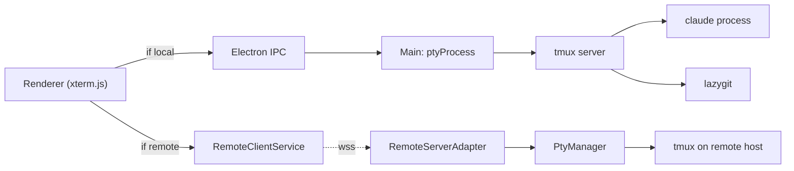
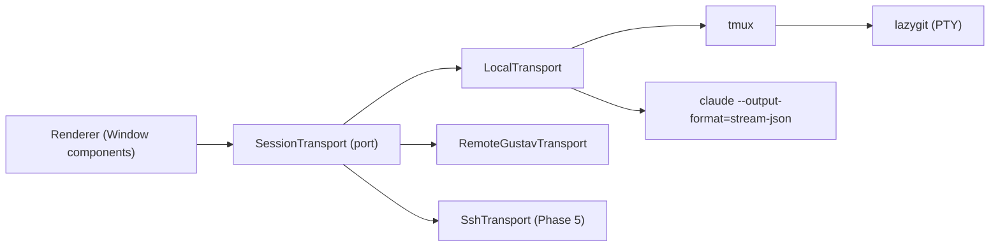
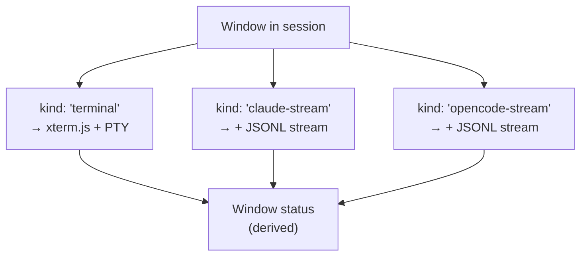

# Architecture Evolution — Design Document

> Status: **Approved direction (2026-04-28).** Architecture target locked; ready to plan Phase 1.
>
> **Revision 3 (2026-04-28) — locked decisions:**
> 1. **Alternative F** is the chosen path: Window Kind + Transport + native Supervisor.
> 2. **Resize policy: latest-wins**, not smallest-wins. Single-active-device is the dominant workflow; the active client must always render correctly. Idle clients catch up on their next interaction.
> 3. **No companion status panel.** Status flows into the existing sidebar slot (and later the window tab header). The win is better source data (JSONL log), same display surface.
> 4. **Sleep-while-busy = kill the session.** Explicit policy.
> 5. **Headless mode: design for it, build it later.** Phase 3 must not block headless; Phase 4 may be deferred.
> 6. **OpenCode parity is deferred.** Architecture must accommodate it; implementation is later.
> 7. **SSH transport targets Linux + macOS first.** Clean port boundaries so Windows can slot in later without re-architecting.
>
> **Revision 2 history (kept for context).** Tmux's actual scope of use is small (sessions + window tabs only — no splits, no prefix). Resize independence is required across attached devices. Claude CLI's input UX stays as-is — we observe via its JSONL log, we do not rebuild.

## Problem Statement

Gustav has reached a comfortable prototype shape. The hexagonal layering (`ports/` + `adapters/` + `services/`) is sound, the Claude session tracking is genuinely useful, and the workspace/repo/session model has held up well. But four pain points are pushing on the architecture at once:

1. **Terminal UX is rough.** Flicker on first paint, occasional resize-to-fix, broken macOS clipboard, awkward shift+drag selection. These look like xterm.js bugs but are mostly tmux-in-the-middle artifacts: tmux owns mouse mode, tmux brokers OSC 52, and the two-stage attach (Electron PTY → tmux client → tmux server) introduces the timing seams that cause visual flicker.
2. **Remote sessions are second-class.** The renderer carries `if (isRemoteSession) sendRemotePtyInput else sendPtyInput` branches in hot paths. New session-level features (resize handle, font sizing, theme reload, claude-status overlay) need to be re-implemented for the remote path or they silently regress. The transport boundary leaks into UI components.
3. **Status detection is brittle.** Claude status comes from `tmux capture-pane | regex`. It works, but it's a dialect of HTML scraping — every Claude UI change is a potential break, and OpenCode would mean a second regex set to maintain. The richer per-tab status the user wants (current tool, plan progress, token usage) is unreachable through this pipe.
4. **Headless deployment is blocked.** A VPS-hosted Gustav is currently impossible: the main process assumes an Electron renderer is attached, the tmux adapter assumes a local socket, and there's no auth model for "this Gustav is the only Gustav, control it from your laptop". Adding it incrementally is harder than designing for it.

If we don't address these, each new feature fights the architecture more than the last. Remote-control gaps and Claude-tracking expansion (OpenCode) are the visible items; tmux flicker and clipboard are the daily papercuts.

## Proposed Approach

Three orthogonal abstractions, layered. Each can be adopted independently and gives value on its own — but together they collapse the current branching into one coherent model.

### Axis 1 — Window Kind + Companion Observers

Today `WindowSpec.kind` is `'claude' | 'command'` and both render through xterm.js because tmux brokers everything. The v1 of this doc proposed a `claude-stream` widget that would replace the Claude CLI entirely. **That is no longer the recommendation.** Claude CLI's input layer (slash commands, `@` references, multi-line edit, status bar, permission prompts, model picker) is too rich and too fast-moving to track in a custom renderer — and it's the part the user actively likes.

Revised model:

```
type Window =
  | { kind: 'terminal'; command: string; cwd: string }   // claude, lazygit, nvim, shell
  | { kind: 'widget'; widgetId: string; config: unknown } // structured panels (ports, logs, ...)
```

Claude stays a `terminal` kind. **What changes is what runs alongside it:**

- A `ClaudeLogObserver` service tails `~/.claude/projects/<encoded-cwd>/<sessionId>.jsonl`. Every event in that file is typed JSON: user/assistant messages, tool calls, tool results, file snapshots, version, parentUuid, etc. The observer emits structured status events.
- Status detection moves from `tmux capture-pane | regex` to "subscribe to log file". Per-tab signals become exact: `idle`, `awaiting-tool-approval`, `tool-running:<name>`, `awaiting-input`, plus the ability to surface things like recent tool usage and plan progress when those become useful.
- **Status flows into the existing display slots.** Sidebar today; window tab headers later. No new companion panel — the surface area is already correct, only the source data improves.
- OpenCode parity is deferred. The observer interface should be defined generically (`AssistantLogObserver`) so a sibling implementation can be added later without re-architecting.

This costs us one new file-tailing service. It buys us exact status, multi-tool-call visibility, and zero coupling to Claude's terminal output format.

`widget` kind remains in the model for future use (port forwards, build output, deploy logs) but ships nothing in Phase 1.

### Axis 2 — Session Transport (the I/O boundary)

Define a `SessionTransport` port in the renderer's contract, with three adapters today and one tomorrow:

```
SessionTransport (port)
├─ LocalTransport        — Electron main → node-pty → tmux/supervisor (today's local path)
├─ RemoteGustavTransport — WebSocket → another Gustav (today's remote path, but unified)
├─ SshTransport          — ssh2 → remote shell directly (no Gustav on the far side)
└─ HeadlessTransport     — same wire as RemoteGustavTransport, but the server is a renderer-less Gustav
```

The renderer only knows `transport.attachWindow(window)`, `transport.sendInput(channel, data)`, `transport.resize(channel, cols, rows)`, `transport.observeState()`. The `if (isRemoteSession)` branches collapse to a single dispatch through whichever transport the active session is bound to. Headless Gustav becomes a build target, not a feature.

### Axis 3 — Session Supervisor (the lifecycle boundary)

This is the load-bearing decision: **does Gustav main own the PTYs directly, or does tmux own them?**

Today tmux owns them. Sleep = kill the tmux session; wake = relaunch and replay window specs. Persistence is free; the cost is the tmux indirection layer (flicker, clipboard, copy mode, status off, prefix None, mouse on — all tmux config plastered into adapters).

**Revised assessment.** Given Gustav uses none of tmux's multiplexing — no splits, no prefix, no copy mode, no status line, no scripting — tmux's role collapses to:

| What tmux gives Gustav today | Native equivalent |
|------------------------------|-------------------|
| `new-session` / `kill-session` | `new Map<sessionId, Window[]>()` + spawn/kill node-pty |
| `new-window` / `kill-window` | push/pop a `node-pty` into the session's window list |
| `select-window` | renderer asks main "stream window N's PTY now" |
| `send-keys` (initial command) | write to PTY stdin at spawn |
| `attach` (PTY connection) | a thin "stream this window to this client" route |
| `capture-pane` (status) | gone — replaced by JSONL log observers |
| Persistence across renderer disconnects | Gustav main is already a long-lived process; PTYs survive trivially |

That's ~10 operations and a small lifecycle state machine. The risk profile of "build a supervisor" is much smaller than v1 implied — we are not reproducing tmux, we are replacing the 5% of tmux Gustav actually exercises.

The supervisor also makes **resize independence solvable on our terms** — see the dedicated section below.

Done well, the supervisor eliminates the flicker/clipboard/dual-client-resize class of bugs and unblocks headless mode. Done poorly, it reintroduces process-management problems (zombie cleanup on Gustav crash, terminal-mode reset on wake) — but those are well-understood and bounded, unlike the v1 fear of "rebuilding tmux".

### Resize Independence (cross-cutting requirement)

The user's hard requirement: when the host and a remote device are both attached, resizing on one must not corrupt the other.

**Why it breaks today.** A tmux session has one logical window size. With two clients attached (Electron's local PTY client + the remote `pty.spawn('tmux', ['attach', ...])` client), tmux's default policy lets the most recent resize win, retaining the largest size in some versions. Each resize emits a redraw to *both* clients, but neither client's xterm.js can render correctly if the new size doesn't match its viewport. Result: the inactive client looks corrupted until it resizes itself.

**Three possible policies, with trade-offs:**

| Policy | What the user sees | Cost |
|--------|-------------------|------|
| **A. Smallest size wins.** Server tracks each attached client's size, picks the minimum, emits one SIGWINCH to the PTY. Both clients render the same content cleanly; the bigger client has unused space at the edges. | Both views always coherent. The bigger device shows a smaller terminal than its window. | Need explicit per-client size tracking. tmux can do this with `set window-size smallest` + `aggressive-resize on`. Native supervisor does it directly. |
| **B. Latest-wins.** The most recent resize from any client drives the PTY size. Idle clients render at whatever size the active client chose. | The active device always looks correct. The idle device looks cramped or has wrap until you switch to it (which triggers its own resize). | Trivially small per-client size tracking. **This matches the actual workflow:** Gustav is used on one device at a time, so the active device should always be perfect. |
| **C. Per-client virtual views with server-side reflow.** Each client gets its own buffer reflowed from the master content stream. | Both views perfect at their own size. | Hard. Requires reimplementing terminal reflow (mosh-class problem). Breaks raw escape sequences from TUIs that rely on cursor positioning. |

**Decision: Policy B (latest-wins).** The implicit assumption Gustav optimizes for is "one active user on one device at a time" — the other device may be attached but isn't the interaction surface. Policy B always gives the active client a correct view. The idle client recovers the next time it's looked at. This is closer to today's behavior; the *fix* is making the resize event clean (one SIGWINCH per real resize, no fights between two tmux clients) — not changing the policy.

Today's bug isn't that latest-wins is wrong; it's that tmux's two-client attach pattern emits dueling resizes that corrupt both clients' displays mid-resize. The native supervisor (Phase 3) fixes this by being the single arbiter of the PTY size — it accepts each client's last-known size and emits exactly one SIGWINCH per real change.

## Alternatives Considered

| Approach | Pros | Cons | Why rejected / kept |
|---------|------|------|--------------------|
| **A. Do nothing.** Polish the current stack: fix mac OSC 52, debounce xterm fit, smooth out remote feature parity case-by-case. | Cheapest. Zero architectural risk. | Doesn't solve flicker root cause. Each new feature still has to ship twice (local + remote). OpenCode adds a second regex parser. Headless remains blocked. | Rejected as the long-term answer, but **kept as Phase 0** — see Recommended Path. |
| **B. Replace tmux with a Gustav supervisor only.** Keep the rest. | Removes flicker/clipboard root causes. Sleep/wake stays simple. | Doesn't help the remote/UI duplication or the OpenCode tracking pain. Risky standalone — a lot of subtle tmux behavior to reproduce. | Rejected as a standalone move; only worth doing in the context of the broader transport + window-kind shift. |
| **C. Window-kind + transport refactor; keep tmux.** Observe Claude via JSONL log, unify local/remote behind a transport port, but leave tmux as the supervisor. | High value-to-effort: kills the regex parser, kills the local/remote branching, gives an OpenCode integration path. Tmux stays the boring substrate it's good at. | Doesn't fix terminal flicker, mac copy, or dual-client resize at the root. Resize-independence ends up dependent on tmux config quirks (`window-size smallest`, `aggressive-resize`) which work but feel fragile. | Strong runner-up. **Was the v1 recommendation.** Now demoted because tmux's scope of use turns out to be small enough that replacing it (Alt F) is comparable effort with strictly more upside. |
| **D. Full rewrite to web-stack daemon (e.g., Bun + Hono on server, browser-only client).** Keep Electron only as a wrapper. | Headless and local become the same code path immediately. Strongest decoupling. | 6–9 months of work. Loses the mature Electron file/clipboard/window APIs. The user already likes the current shape — this throws it away to solve a specific subset. | Rejected. Out of proportion to the problems. |
| **E. Adopt zellij or wezterm-mux as the multiplexer.** | Modern, scriptable, structured. | Same fundamental indirection as tmux; replaces one external dependency with another less-stable one. Doesn't address the clipboard/flicker/dual-client-resize root causes (those are about *having* a multiplexer in the path, not which one). | Rejected. Net move sideways. |
| **F. Window-kind + transport refactor + native supervisor.** Replace tmux with a Gustav-owned PTY supervisor (covering only the ~10 ops Gustav actually uses), observe Claude via JSONL log, unify local/remote behind a transport port. | Resize policy (smallest-size-wins) becomes ours to enforce explicitly. Removes the entire two-stage attach (Electron → tmux client → tmux server). Headless mode is just "Gustav main without a renderer". Persistence falls out of the existing main-process lifetime. | More upfront engineering than C. Process-management edge cases (zombie cleanup, mode restoration on wake) need explicit handling. One-time cost of writing the supervisor and migrating existing persisted sessions. | **Recommended primary direction.** Given how little of tmux Gustav uses, the cost gap to C is small and the structural benefits are large. |

## Key Decisions (proposed for approval)

1. **Adopt the three-axis decomposition (Window Kind / Transport / Supervisor) as the architectural target.** Even if we don't migrate all axes immediately, the *vocabulary* should land in the codebase: it's how we'll talk about future work.
   - Trade-off accepted: more concept overhead in the short term in exchange for cleaner feature additions later.

2. **Pick Alternative F as the recommended primary direction.** Window Kind + Transport + native Supervisor, in that order. The supervisor work is no longer deferred indefinitely — it's the only path that solves resize independence on our terms.
   - Trade-off accepted: more upfront engineering than v1's "keep tmux" recommendation. Bought back in correctness on dual-client resize and a clean headless story.

3. **Don't replace Claude CLI's input UX. Observe its JSONL log instead.** Claude stays a `terminal`-kind window. A new `ClaudeLogObserver` tails `~/.claude/projects/<encoded-cwd>/<sessionId>.jsonl` and emits structured status events. **Status flows into the existing sidebar slot** (and later window tab headers) — not a new panel.
   - Trade-off accepted: we don't get a "richer" Claude *input* (slash commands, skills, etc., remain whatever the CLI offers — which is already what the user wants). We do get exact structured *status* using surface area we already have.

4. **Resize policy: latest-wins.** Whichever client most recently resized drives the PTY size; idle clients catch up on next interaction. The native supervisor in Phase 3 enforces this as a single arbiter (one SIGWINCH per real change, no dueling clients).
   - Trade-off accepted: the idle device shows wrap/scroll between resizes. Acceptable because Gustav is used on one device at a time — the active client always renders correctly, which is what matters.

5. **Sleep-while-busy = kill.** Sleeping a session terminates whatever's running in it (Claude included). Wake restarts from spec; for Claude, the resume ID is preserved in the persisted window so the conversation continues. This matches today's implicit tmux `kill-session` behavior; we just make it policy.
   - Trade-off accepted: a long-running tool call dies on sleep. Mitigation: if needed later, a "busy → confirm before sleep" prompt can be added without changing policy.

6. **Headless mode is a deployment of Gustav main without the renderer, reachable only via the existing Remote protocol.** Not a separate codebase, not a separate auth model. **Phase 3 must not architecturally block headless**, but the actual headless build target ships in Phase 4 (low priority).
   - Trade-off accepted: we have to be disciplined about what lives in `main/` vs what lives in `renderer/`. Some current main-process assumptions (active BrowserWindow, theme broadcast, did-finish-load) need conditionalizing — but only enough that they *can* be conditional later.

7. **Transport port supports Linux + macOS first; Windows-clean.** `SessionTransport` adapters (and the future SSH transport) are designed against a port interface that doesn't bake in POSIX assumptions. Windows isn't a Phase 5 target, but a future Windows adapter must not require re-architecting the port.
   - Trade-off accepted: a few PTY/shell calls have to be routed through the port even when only Linux/macOS implementations exist. Small overhead today, large savings if Windows ever gets prioritized.

## Resolved Questions

All Phase 1 blockers are resolved as of Revision 3:

| Question | Resolution |
|----------|------------|
| JSONL log format stability across Claude CLI versions. | **Stable per human.** Architect proceeds assuming the documented fields hold; parser tolerates unknown fields gracefully. |
| OpenCode observability story. | **Deferred.** Address when OpenCode parity is implemented (post-Phase 3). The observer interface is generic (`AssistantLogObserver`) so OpenCode slots in without changing Claude code. |
| Headless deployment surface (auth, certs, network). | **Deferred to a separate brainstorm.** Phase 3 leaves the door open; Phase 4 picks the topic up. Low priority. |
| Sleep-while-Claude-is-busy. | **Kill the session.** See Decision 5. |
| SSH transport platform support. | **Linux + macOS first; Windows-clean port boundaries** so Windows can be added later without re-architecting. See Decision 7. |
| Resize policy. | **Latest-wins.** See Decision 4. |
| Multi-pane (split-window) support. | **Dropped.** Gustav doesn't use it. |
| Claude CLI input UX (slash commands, `@`, status bar, permission prompts). | **Unchanged.** We observe, we do not rebuild. |

## Scope Boundaries

### In scope for the architectural target

- Generalizing `WindowSpec.kind` to a tagged union of render strategies.
- A `SessionTransport` port with `Local` / `RemoteGustav` adapters, designed so `Ssh` and `Headless` slot in later.
- A first widget: Claude stream-JSON renderer with status derived from events.
- A path for OpenCode parity that doesn't require a second regex parser.
- Headless-mode design constraints — main process must remain runnable without a `BrowserWindow`.

### Explicitly out of scope (for now)

- Replacing tmux. (Re-evaluated after Phase 2.)
- A general-purpose plugin/widget API. We design *with* future widgets in mind, but ship one (Claude) and one more (OpenCode) before opening a public surface.
- Cross-machine session migration ("move this session from desktop to laptop"). Interesting, not on this roadmap.
- Multi-user / multi-client-per-server. The remote model is still 1 server : 1 client.
- A redesigned theming system. Omarchy adaptation works; leave it.

## Recommended Path (phased)

A specific sequence with checkpoints. Each phase is self-contained and shippable; no phase commits us to the next. **Revised ordering** in this revision: the supervisor work moves up because it's the only complete fix for resize independence and clipboard, and because tmux's footprint in Gustav is small.

### Phase 0 — Stop the bleeding (3–7 days)
*No architectural changes. Pure pain relief, runnable in parallel with Phase 1 planning.*
- **Resize fights between attached clients:** policy is latest-wins (Decision 4). Today's tmux behavior is roughly latest-wins but the dual-attach pattern produces dueling resize events. Investigate whether `aggressive-resize on` alone suffices to clean this up at the tmux layer (idle client renders cropped/wrapped instead of corrupted). Full cleanup lands in Phase 3 with the native supervisor.
- **mac OSC 52 clipboard:** enable `set -g set-clipboard on` in tmux + xterm.js `clipboard` addon. Likely a 1-day fix.
- **First-paint flicker:** investigate as a fit-on-mount race, not a tmux issue. Add a `requestAnimationFrame` gate or wait for first PTY data before fitting.
- **Remote-control gap audit:** produce a delta list of "what local can do that remote can't" — but only fix the top 3 by user-impact this phase. Most gaps will close automatically after Phase 2 (transport unification), so resist the urge to fix them all twice.

**Ship gate:** macOS clipboard works without shift+drag. Resizing the active device gives a clean redraw on that device.

### Phase 1 — Claude log observer (1–2 weeks)
*Highest value-to-effort. No architectural breakage. Existing display surfaces.*
- Build `ClaudeLogObserver` (a generic `AssistantLogObserver` interface, with a Claude implementation today): tails `~/.claude/projects/<encoded-cwd>/<sessionId>.jsonl` for each tracked Claude session, emits typed status events (`busy`, `tool:<name>`, `awaiting-input`, `idle`, etc.).
- Wire it into the existing `ClaudeSessionTracker` so status flows through the same channel into `WorkspaceAppState`.
- Replace regex `parseRawStatus` with log-driven status for windows where we have a session ID; keep regex as a fallback only when the log isn't available yet (e.g., right after spawn).
- **Display:** the existing sidebar status indicator already consumes `ClaudeStatus` — richer events plug in there. Window-tab-header status shows up later (separate visual change, not blocking).
- Generalize `WindowSpec.kind` to `'terminal' | 'widget'` (preparing for future widgets) but ship only `terminal` kind in this phase. Migration: existing `kind: 'claude' | 'command'` collapses to `kind: 'terminal'` with a `command` field.

**Ship gate:** Sidebar status reflects what Claude is actually doing (current tool name, busy/idle, action-needed) without any new UI surface. Claude CLI behavior is unchanged.

### Phase 2 — Transport unification (3–4 weeks)
*Removes the local/remote duplication. Prerequisite for the supervisor work.*
- Define `SessionTransport` port. Port methods deliberately avoid POSIX-specific assumptions so a future Windows adapter is purely additive. Implement `LocalTransport` and `RemoteGustavTransport` as adapters.
- Renderer hooks (`use-terminal`, status consumer, etc.) consume the active transport, not direct `window.api` calls. The `if (isRemoteSession)` branches in `use-terminal.ts` and elsewhere go away.
- IPC handlers in main are reorganized so the same command shape works whether dispatched locally or routed through the remote protocol.

**Ship gate:** Adding a new session feature requires changing one place, not two. Renderer code is unaware of where the session lives. Remote-control feature gaps from Phase 0's audit are mostly closed automatically.

### Phase 3 — Native supervisor (4–6 weeks)
*The structural fix. Replaces the ~10 tmux operations Gustav actually uses.*
- Build `SessionSupervisor` in main: owns a `Map<sessionId, Window[]>` where each Window holds a `node-pty` plus metadata.
- Implement: create/kill session, add/remove window, switch active window (renderer-driven), per-client size tracking, **latest-wins resize** (single arbiter — one SIGWINCH per real change, no dueling clients).
- Sleep/wake: **sleep kills PTYs unconditionally** (Decision 5); wake respawns from spec. Claude resume IDs ride in the persisted spec so conversations continue.
- Strangler migration: `LocalTransport` gains a `supervisor: 'tmux' | 'native'` choice. Default tmux until native is proven on dogfood; flip the default once stable; remove tmux adapter once flipped for ~one release.
- **Headless prerequisite:** the supervisor must be reachable purely via the existing Remote protocol, with no BrowserWindow assumption in its API. The actual headless build target ships in Phase 4 — but Phase 3 must not bake renderer-coupling into the supervisor.

**Ship gate:** Local sessions feel snappier (no two-stage attach). Resizing on one device gives that device a clean redraw with no display fights. The supervisor runs the same code path for local and remote; nothing in its surface area assumes a renderer is attached.

### Phase 4 — Headless deployment (deferred, 2–3 weeks when picked up)
*Low priority. Brainstormed separately before implementation begins.*
- Headless build target: Gustav main starts without a `BrowserWindow` when `--headless` is passed; `did-finish-load`-style hooks become no-ops.
- Operations: systemd unit (or equivalent), log rotation, single-user assumption documented, cert/auth flows verified end-to-end.
- Open at planning time: SSH-based bootstrap vs Tailscale-only? Self-managed certs vs Let's Encrypt? These are the topics for the headless brainstorm.

**Ship gate:** A separate headless design doc, then a runnable `gustav-headless` on a VPS.

### Phase 5 — OpenCode parity (deferred)
*Architectural slot already exists; implementation when prioritized.*
- Add an `OpencodeLogObserver` (or equivalent) implementing the generic `AssistantLogObserver` interface. Falls back to capture-pane parsing if OpenCode has no structured log.
- No transport, supervisor, or window-kind changes required.

### Phase 6 — SSH transport (optional, deferred; Linux/macOS first)
- Drop-in `SshTransport` adapter using `ssh2` (or equivalent). Works with `terminal` window kinds against arbitrary remote shells. No Gustav required on the far side; no assistant log tracking on the far side unless those CLIs are installed there.
- Port boundary designed in Phase 2 keeps Windows clean for a future addition without rewrites.

## Visual Artifacts

### Today



Two parallel pipes, two sets of conventions, both touching the renderer.

### After Phase 2



Same renderer code regardless of where the session lives.

### Window Kinds dispatch



Status is derived from each kind's natural signal, not from a regex over a captured screen.

## Next Step

Direction is locked. The next artifact is a **Phase 1 plan** specifying file-level changes for the `ClaudeLogObserver` and its integration into `ClaudeSessionTracker` / `WorkspaceAppState` / sidebar status. That belongs in a separate planning document, not this one.

Phase 0 (Stop the bleeding) can run in parallel with Phase 1 planning since it requires no architectural decisions.

## Phase 3 — Implementation Notes (2026-04-28)

The Phase 3 supervisor has shipped behind a strangler flag. Highlights:

- `NativeSupervisor` (`src/main/supervisor/native-supervisor.ts`) owns node-pty processes directly. It is Electron-free — no `BrowserWindow`, `app`, or renderer-coupled imports — so a future headless deployment can use it without modification.
- The supervisor is a pure Node class injected with a `SupervisorPtyFactory`. The production factory wraps `node-pty`; tests inject a fake (`src/main/supervisor/__tests__/fake-pty.ts`).
- IPC mirroring: every supervisor method has an `supervisor:` IPC channel, registered in `src/main/ipc/supervisor-handlers.ts`. Existing tmux IPC stays untouched.
- Renderer entry point: `src/renderer/lib/transport/supervisor-client.ts` wraps the IPC surface. Hooks/components migrate at their own pace.
- Latest-wins resize is enforced by a single arbiter: each `ClientView` has an attach clock; the supervisor picks the highest-clock client's size and emits **one** `pty.resize()` per real change to the active window. Background windows lazy-resize on `selectWindow`.
- Sleep/wake follows Decision 5: sleep unconditionally kills PTYs and marks windows `exited` while retaining the spec; wake respawns from spec, including `claude --resume <id>` via the existing `composeClaudeCommand`.
- Per-window scrollback ring buffer (raw bytes, capped at 100KB) so a renderer reattaching to a previously-active session gets immediate content.
- Claude observer integration: when a `claude`-kind window with a known `claudeSessionId` spawns, `assistantLog.track()` fires. On window/session kill (or PTY exit), `assistantLog.untrack()` fires. Behavior matches `ClaudeSessionTracker` for the tmux path.

### Strangler flag

Preference key: `sessionSupervisor: 'tmux' | 'native'`. Default: `'tmux'` (undefined treated as tmux). No UI control yet — toggle by editing `~/.local/share/gustav/preferences.json`:

```json
{
  "sessionSupervisor": "native"
}
```

Phase 3 instantiates `NativeSupervisor` always; the IPC surface is live regardless of preference. Whether the renderer routes to it is the consumer's choice. Existing sessions stay on whichever backend created them — once tmux, always tmux until destroyed.

### Deferred to Phase 3.5 / follow-up

- Migrating `use-terminal` (renderer hook) and other consumers to drive `SupervisorClient` directly when the preference is `native`. The IPC surface and client wrapper exist; the consumer migration is mechanical but voluminous.
- A UI control for the preference (advanced settings panel).
- Removing tmux: blocked until the native path is dogfood-stable for at least one release.
